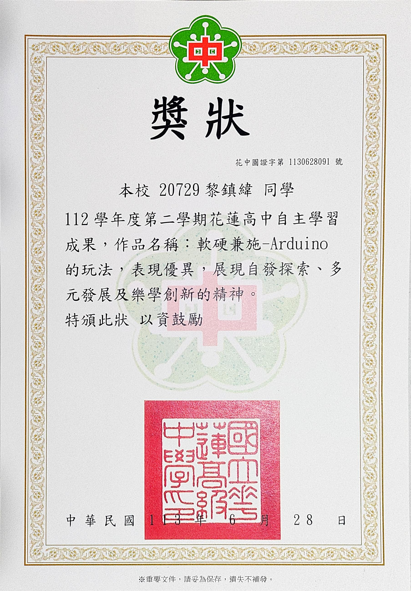
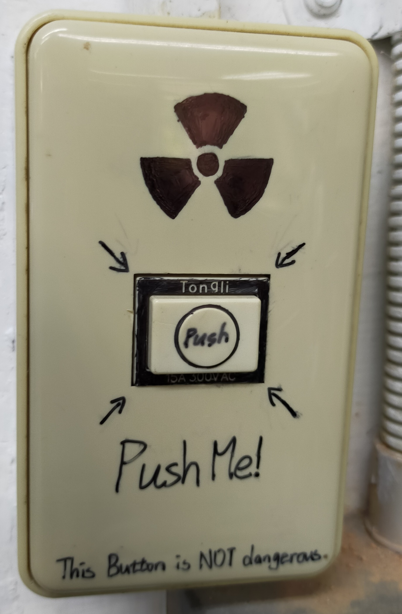

# Arduino自主學習整理
新版本在[這裡](/README_NEW.md)
## 簡述

自主學習計畫，為了把小型時間顯示裝置放在主機裡，並且不影響顯卡換氣； 
更糟的是，晚上它不會自己關燈，造成嚴重光害。 
為了暫時讓房間有時間觀念，因此我打算做一個裝置暫時取代它。

## 材料
- Arduino UNO
- 5641B 四位7段顯示器
- 光敏電阻
- 按鈕x3
- 電阻(220Rx8，10kRx1)
- 杜邦線x24

## 5641B接腳定義
| Arduino Pin | 5641B Pin | Definition |
| :--: | -- | -- |
| **2** | 7 | B |
| **3** | 10 | F |
| **4** | 11 | A |
| **5** | 5 | G |
| **6** | 4 | C |
| **7** | 2 | D |
| **8** | 1 | E |
| **13** | 3 | DP |
| **9** | 9 |  Dig2 |
| **10** | 12 | Dig1 |
| **11** | 8 | Dig3 |
| **12** | 6 | ig4 |

btn接腳定義
| ArduinoPin | btn Feature |
| :--: | -- |
| **15** | + |
| **16** | - |
| **17** | Mode |

光敏電阻接腳定義
| ArduinoPin | - |
| :--: | -- |
| **14** | Light |

# 獎狀

  
   

影片網址點底下(這只是一顆總電源開關，那些圖示是我用奇異筆畫出來的)   

